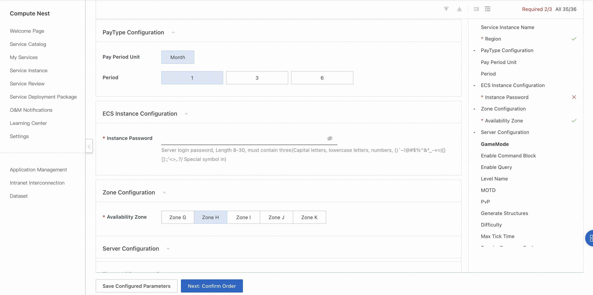
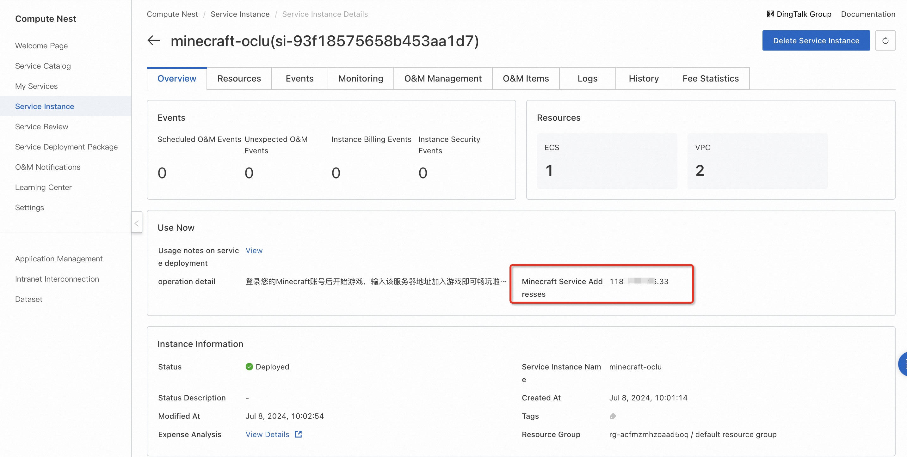
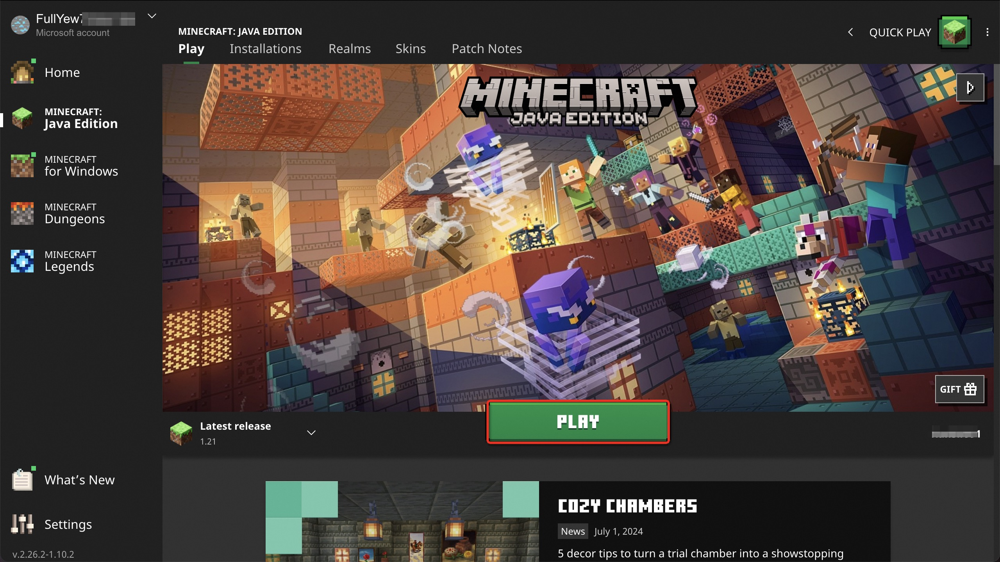
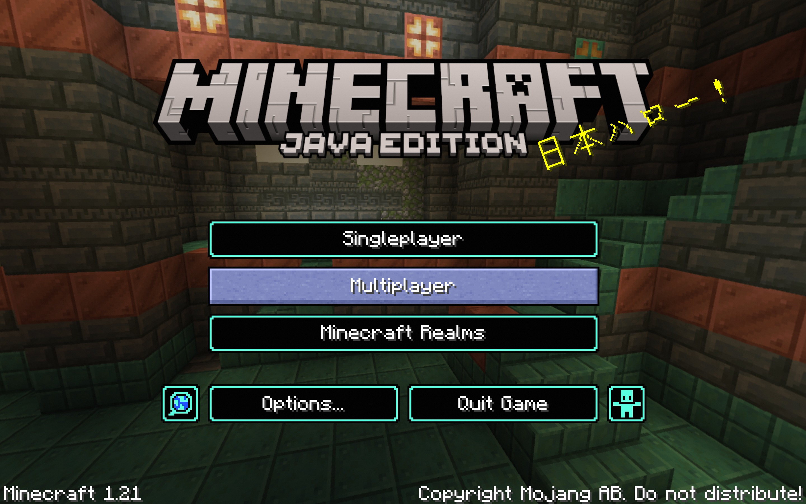
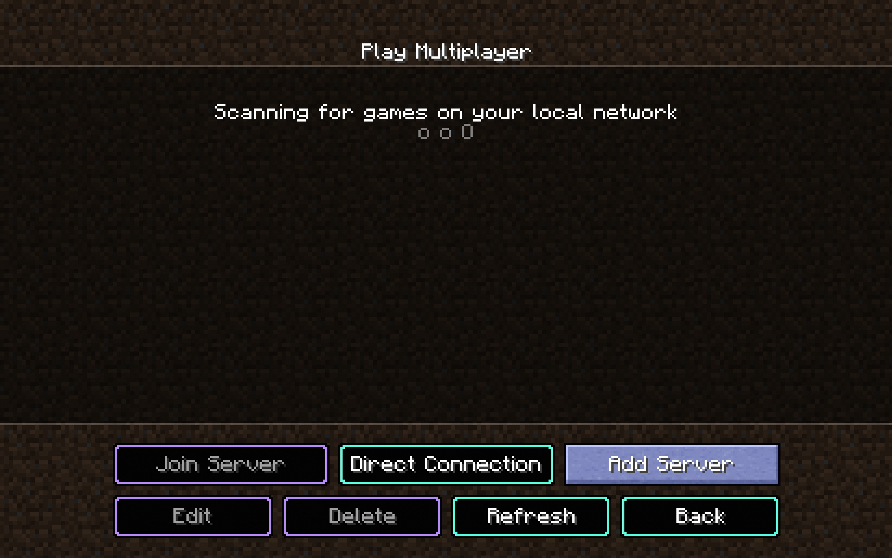
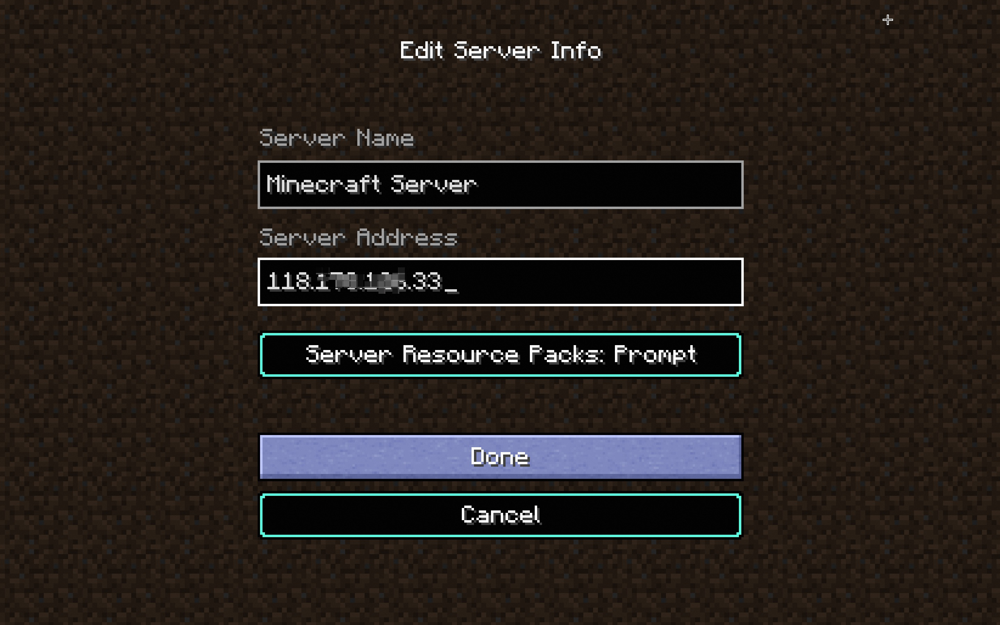
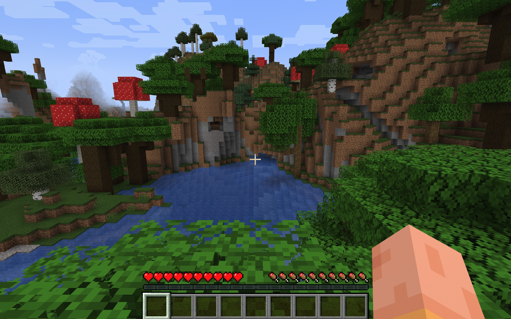

<h1> Deploy My World Online Service in 3 minutes </h1>

<h2> Overview </h2>

 Minecraft (Minecraft) is a sandbox video game in which the player is free to create and destroy different kinds of blocks in a three-dimensional space filled with blocks. Players can complete the game's achievements (progress) by destroying or creating exquisite buildings and art, or collecting items to explore the map in single or multiplayer mode. 

<h2> Billing instructions </h2>

 the cost of my world online service on the computing nest mainly involves: the selected vCPU and memory specifications, disk capacity, public network bandwidth
Billing methods include: annual package, monthly package, pay-as-you-go (hours)
The estimated cost can be seen in real time when the instance is created. 

<h2> Create an ECS </h2>

<h3> Step 1: Select Configuration </h3>

<ol>
<li> Service instance name (if there is no special requirement, keep the default);</li>
<li> Select the deployment region (you can select the city closest to you. If there are no special requirements, keep the default value);</li>
<li>
 Select configuration:

<table>
<thead>
<tr>
<th> Package name </th>
<th> Description </th>
</tr>
</thead>
<tbody>
<tr>
<td> Supports up to 10 players </td>
<td>4-core 16G,10M bandwidth unlimited traffic </td>
</tr>
<tr>
<td> Supports up to 20 players </td>
<td>8-core 32G,10M bandwidth unlimited traffic </td>
</tr>
<tr>
<td> Custom Package </td>
<td> ECS configuration can be freely selected (at least 16G of memory for selected specifications), suitable for high-level DIY players </td>
</tr>
</tbody>
</table>

<li>
 Configure the server password and Availability Zone (if there are no special requirements, keep the default). 
</li>
<li> configure the game parameters. after the configuration is completed, click next to confirm the submission of the order.
</li>
</ol>

<h3> Step 2: Create a service </h3>

<ol>
<li> on the service confirmation page, check agree to the terms of service, click "create now", followed by the payment process. </li>
<li> when the prompt of successful submission appears, the service has been created. click "go to the list to view" to see that the service is being deployed.
</ol>

<h3> Step 3: Enter the instance details </h3>

<ol>
<li> the service can be created in less than 1 minute. when the service status changes to "deployed", click the service instance ID to enter the service details.
<li> by the time of this step, the server-side installation program of my world has been preset in the image of the service, which is very convenient without manual replication. </li>
<li> see "my world server address port", which is the IP address where you built the server. copy this address for the next operation.
</li>
</ol>

<h2> Login to the game </h2>

 Pre-condition: You have purchased My World and installed the PC side. 

<ol>
<li>
 Log in to your minecraft account and start the game.

</li>
<li>
 Select Multiplayer.

</li>
<li>
 Add the server.

</li>
<li>
 Enter the server address where the service instance details are also obtained and click Done.

</li>
<li>
 select the new server and join to play.

</li>
</ol>
