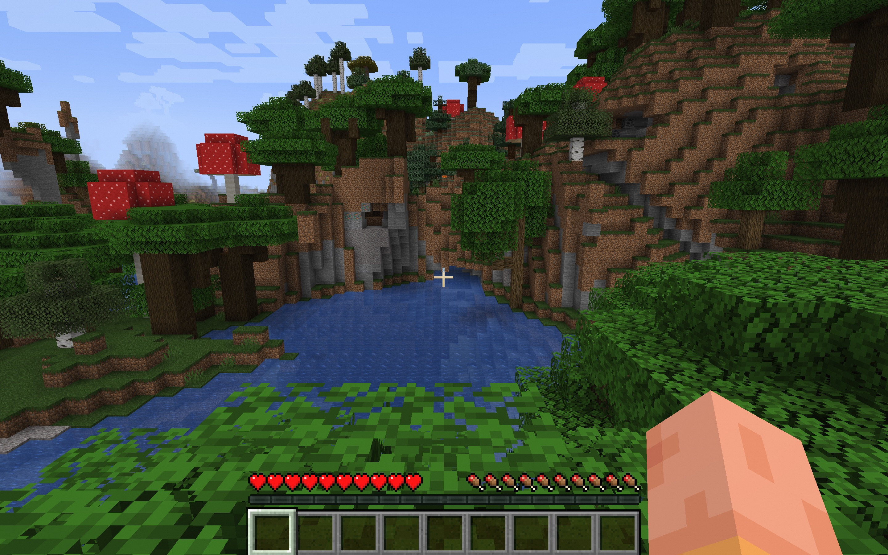

# 3分钟部署我的世界联机服务

## 概述

我的世界（Minecraft）是一款沙盒类电子游戏，该游戏以玩家在一个充满着方块的三维空间中自由地创造和破坏不同种类的方块为主题。玩家在游戏中可以在单人或多人模式中通过摧毁或创造精妙绝伦的建筑物和艺术，或者收集物品探索地图以完成游戏的成就（进度）。

## 计费说明

我的世界联机服务在计算巢上的费用主要涉及：所选vCPU与内存规格、磁盘容量、公网带宽
计费方式包括：包年包月、按量付费（小时）
预估费用在创建实例时可实时看到。

## 创建云服务器

### 第一步：选择配置

1. 服务实例名称（如无特殊要求，保持默认即可）；
2. 选择部署地域（可以选择离自己最近的城市，如无特殊要求，保持默认即可）；
3. 选择配置:

   | 套餐名       | 说明                                 |
   |-----------|------------------------------------|
   | 最多支持10个玩家 | 4核16G，10M带宽不限流量                    |
   | 最多支持20个玩家 | 8核32G，10M带宽不限流量                    |
   | 自定义套餐     | 可自由选择ECS配置（所选规格的内存至少16G），适合高阶DIY玩家 |

   

4. 配置服务器密码和 可用区（如无特殊要求，保持默认即可）。
5. 配置游戏参数，配置完成之后，点击下一步，确认提交订单。
   

### 第二步：创建服务

1. 在服务确认页面，勾选同意服务条款，点击“立即创建”，后面就是付款流程。
2. 当出现提交成功提示，说明服务已经开始创建，点击“去列表查看”，可以看到服务正在部署中。
   

### 第三步：进入实例详情

1. 服务不到1分钟即可完成创建，当服务的状态变成“已部署”，点击服务实例ID进入服务详情。
   
2. 到这一步的时候，我的世界的服务端安装程序已经预置在服务的镜像里了，无需手动复制，非常方便。
3. 看到“我的世界服务器地址端口”，这就是你搭建服务器的IP地址了，复制这个地址用于下一步操作。
   

## 登录游戏

前置条件：您已购买我的世界并安装PC端。

1. 登录您的minecraft账号并开始游戏。

   

2. 选择多人游戏。
   

3. 添加服务器。
   

4. 输入服务实例详情也获取的服务器地址并点击完成。
   

5. 选择新加的服务器并加入即可畅玩啦。
   
   
